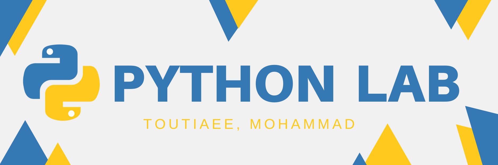
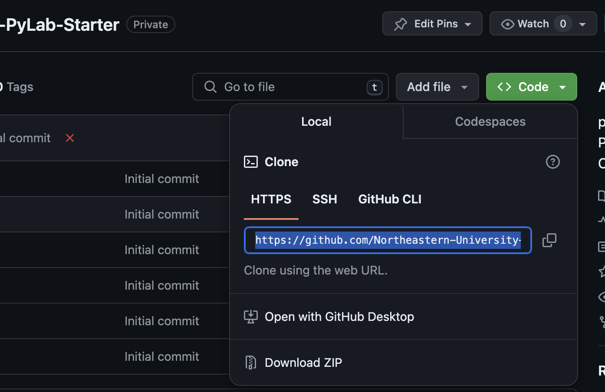
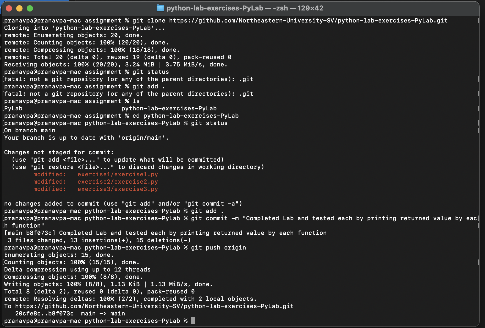

# Python Lab Exercises

Welcome to the Python Lab Exercises! This repository contains three engaging exercises designed to enhance your Python skills and demonstrate practical applications. Follow the instructions below to complete each exercise.

## Explore the Exercises 🔭
The problem statements are available at each exercise's sub-folders:  

* [Exercise 1: Factorial Calculation](https://github.com/Northeastern-University-Assignments/PyLab/tree/main/exercise1)  
* [Exercise 2: Palindrome Checker](https://github.com/Northeastern-University-Assignments/PyLab/tree/main/exercise2)  
* [Exercise 3: Custom List Sorting](https://github.com/Northeastern-University-Assignments/PyLab/tree/main/exercise3)

## Getting Started 🏃🏻‍♂️‍➡️

1. Clone the Repository  
 Open your terminal and enter the following command to clone the repository:
   ```jsx   
   git clone https://github.com/Northeastern-University-Assignments/<name_of_repository_created>.git
   ```
* Note: Replace `name_of_repository_created` with your repository. URL can be found at:  


2. Navigate to the folder where repository is cloned:
   ```jsx   
   cd pylab
   ```
3. Pull the repository:
   ```jsx
   git pull origin main
   ```
3. Open the folder in desired IDE, navigate to the folder of which exercise you want to do, and complete the lab by filling in the placeholders.  
🧑🏻‍💻🧑🏻‍💻🧑🏻‍💻
4. (Optional) Test the implemented functions.

## Want it simpler? 😓
You can use the [GitHub Desktop](https://desktop.github.com/) app to get started hasstle free.  
1. 🪞 Clone Repository from `File` menu-tab.
2. 🔗 Enter the path and the URL to the repository that just got created:
   ```jsx   
   https://github.com/Northeastern-University-Assignments/<name_of_repository_created>.git
   ```
* Note: Replace `name_of_repository_created` with your repository. 
3. 🔁 Once cloned, fetch origin.
4. ✚ The changes done in the path would be reflected in the sidebar of the application. 
5. ✍️ Enter a meaningful message in the `Summary` and `Commit to main`
6. ⬆️ Push to origin   


## Submitting using Terminal ✅
1. To commit your changes enter:
   ```jsx
   git add .
   git commit -m "Completed Exercise X"
   ```
   * Note: Write descriptive commit messages!

2. Push your changes:
   ```jsx   
   git push origin main
   ```
   



## Grading and Feedback 💯
Each exercise is configured with an autograder that provides immediate feedback on your submissions.
* Exercise 1 uses GitHub's built-in autograder with input/output tests.
* Exercise 2 uses GitHub's built-in autograder with a `test2.py` file.
* Exercise 3 uses a custom autograder with `ci.yml`, `pytest`, and generates an HTML test report.

### Accessing Test Reports 📑
An HTML report and a coverage report will be generated on push or pull request, and can be found by following the steps bellow:
1. Navigate to the *Actions* tab of your repository 
```jsx
https://github.com/Northeastern-University-Assignments/<name_of_repository_created>/actions
```
* Note: Replace `name_of_repository_created` with your repository.  
2. Find the workflow run for your latest push.
3. Download the `test-report` and `coverage-report` artifacts.

## Help and Discussion 🤔
* Report any issues or ask questions using the [Issues](https://github.com/Northeastern-University-Assignments/PyLab/issues) tab.
* Use the [Discussions](https://github.com/Northeastern-University-Assignments/PyLab/discussions) tab to ask questions, share your progress, and help each other.

#### Enjoy the lab exercises and happy coding! 💻